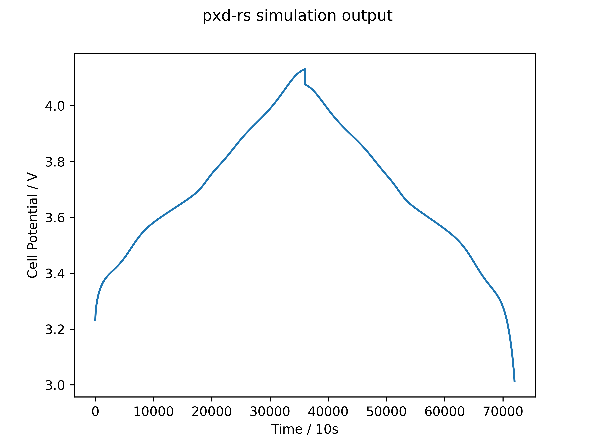

# pxd-rs
Rust implementation of the SPMe battery model.

Numerical method is central difference and forward Euler.

## Status

- [x] Empirical open circuit voltage functions
- [ ] Fickian diffusion in electrolyte
- [x] Fickian diffusion in particles
- [ ] Butler-Volmer kinetics
- [ ] Migration in electrolyte

